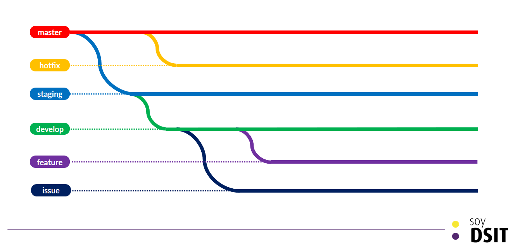
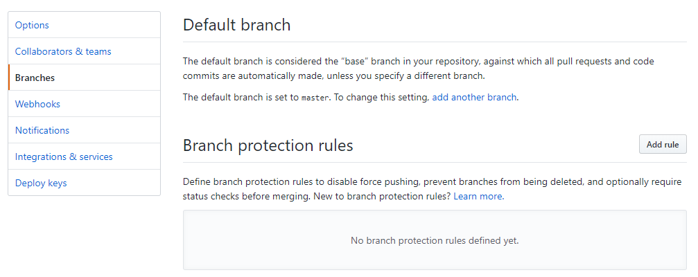
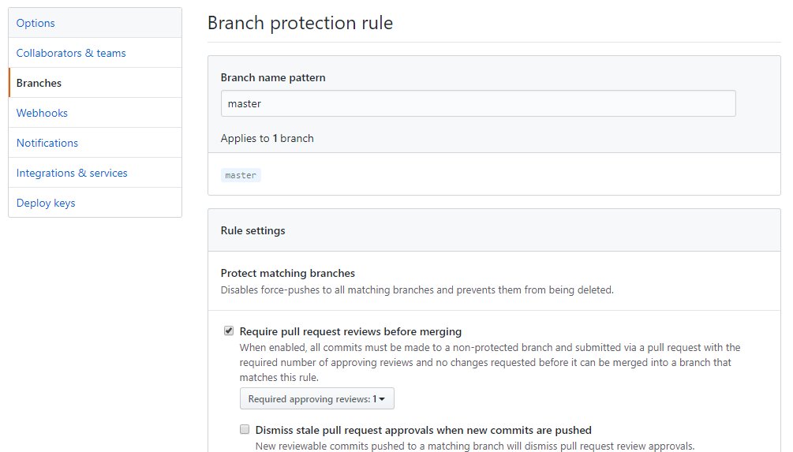
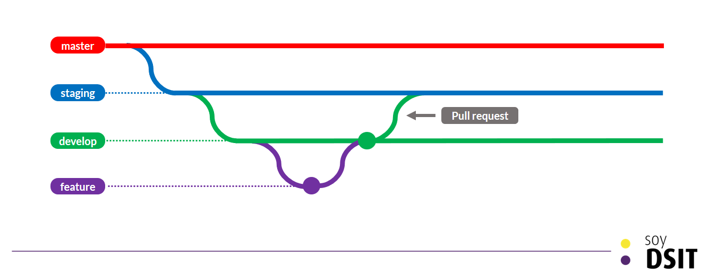
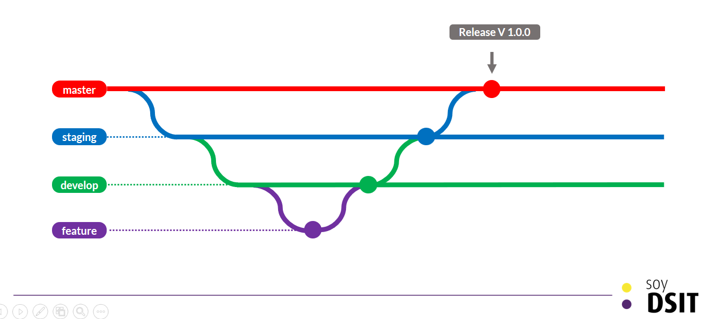
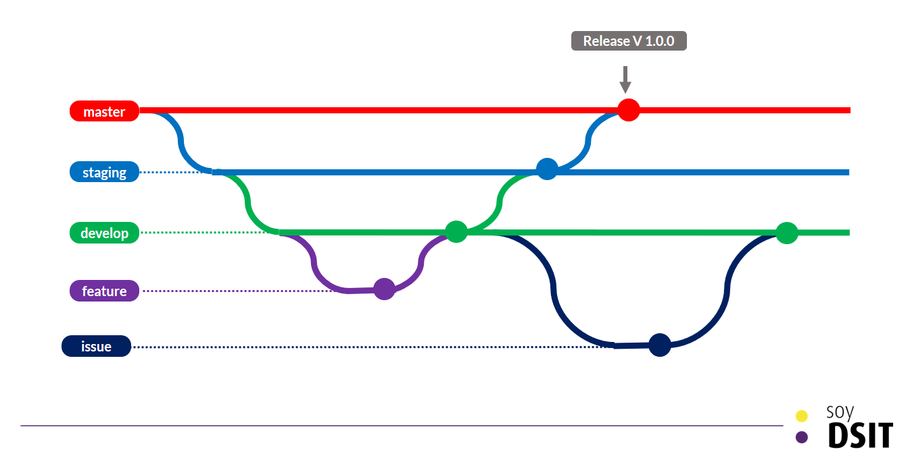
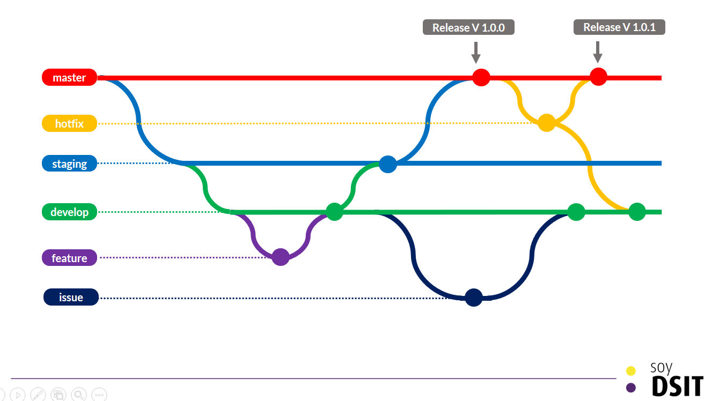

# Manejo de ramas
En este capítulo se explica como se realiza el manejo de las ramas para los proyectos en los repositorios de código de la Dirección de Servicios de Información y Tecnologías DSIT de la Universidad de Los Andes.

## Roles en el repositorio

* Developer
* Tester
* Deployer
* Mantainer
* Líder funcional

### Developer
Encargado del desarrollo de código al igual que las pruebas unitarias. Es responsable de aplicar **buenas prácticas de desarrollo**, desarrollar **pruebas unitarias** y garantizar que su código pueda ser integrado con el desarrollo de los demás miembros del equipo.

### Tester
Encargado de validar que el desarrollo cumple con las funcionalidades solicitadas por el cliente. Su principal responsabilidad es ejecutar **pruebas de sistema** para validar y verificar que un desarrollo puede pasar a **pruebas de aceptación** de cliente. Tiene la potestad de detener el flujo del desarrollo cuando no se cumplen con ciertos estándares o funcionalidades.

### Deployer
Encargado del despliegue del código en fase de staging (pre-productivo) y producción. Su responsabilidad es el despliegue correcto de los cambios realizados en desarrollo, posterior a la aprobación del tester. Dependiendo del proceso de integración y despliegue continuo este rol puede ser manejado automáticamente y no requiere de una persona.

### Mantainer
Administrador y principal responsable del repositorio. En su función como líder técnico en el proyecto tiene la responsabilidad de garatizar que el gitflow se está siguiendo correctamente. Además es el usuario que da la aprobación para el paso de cambios a la rama master del desarrollo.

### Líder funcionalidad
Usuario dueño de la aplicación, es la persona que solicita el desarrollo o mejoras, y quien realiza la validación del desarrollo por medio de **pruebas de aceptación**.

## Ramas

Las ramas para todos los proyectos son:

* master
* staging
* develop
* hotfix
* feature
* issue



### master
La rama master es la rama principal del repositorio. Esta es la rama que alberga el código que será desplegado en producción y sobre el que se maneja el versionamiento de la aplicación. Esta rama tiene las siguientes reglas:
* El código no debe tener problemas de integración, compilación ni ejecución
* El código debe haber sido probado por el tester y líder funcional (usuario que solicitó la solución)
* Solo el mantainer puede mezclar cambios a esta rama
* El versionamiento se realiza haciendo uso de la nomenclatura _____
* La mezcla de cambios está limitada por la función de Pull request, no se permiten merge.

Para asegurar que los cambios solo sean mezclados haciendo uso de pull request, el mantainer puede agregar reglas las cuales se crean en el repositorio por medio del menú settings.
<dt> Paso 1 <dt>

<dt> Paso 2 <dt>


### staging
La rama de staging o pre-productiva es la rama utilizada para preparar el release de entrega y realizar las pruebas de aceptación. Sobre esta rama el desarrollador realiza las tareas pre-release como son documentación, agregar información de configuración, y cualquier tarea adicional que no es específica del desarrollo. Al tiempo, es la rama en la cual se ejecutan pruebas de aceptación del líder funcional o usuario final. Esta rama tiene las siguientes reglas:
* El código no debe tener problemas de integración, compilación ni ejecución
* El código debe haber sido probado por el tester
* Solo el tester puede mezclar cambios de código a esta rama.
* El desarrollador puede agregar cambios a la rama que no sean de archivos de código
* La mezcla de cambios está limitada por la función de Pull request, no se permiten merge.
* En la rama se trabaja una versión de la aplicación a la vez, al pasar a producción la rama debe quedar identica a master. No se deben trabajar en dos versiones de la aplicación a la vez.
* Es una rama que se crea directamente de master

### develop
La rama de develop es la rama de desarrollo, sobre esta rama se mantiene la integración de todos los desarrollos que se están trabajando en paralelo por el equipo. Esta rama tiene las siguientes reglas:
* El código no debería tener problemas de integración, compilación ni ejecución
* El código debe haber sido probado por el Developer
* Cualquier desarrollador puede mezclar cambios a esta rama
* Todo cambio presente en master o staging debe estar mezclado en esta rama
* Esta rama se crea de staging

### feature
Las ramas de feature son ramas de caracter temporal que están destinadas para albergar el código de un developer o varios, que estén trabajando sobre una funcionalidad o característica (feature) de la aplicación. Estas ramas tienen las siguientes reglas:
* Se crean directamente de develop
* Su propósito es albergar el código de una funcionalidad, ejemplo: un caso de uso, una historia de usuario.
* Se nombran de la manera **<<Código del feature>>-feature**
* Al finalizar el desarrollo y posterior a la aprobación del tester, la rama debe eliminarse
* Para evitar conflictos sobre la rama de develop, todos los conflictos deben ser resueltos sobre estas ramas.

### hotfix
Las ramas de hotfix son ramas de caracter temporal que se crean para la atención de un error crítico en la aplicación, que no puede esperar al despliegue de una nuevo release. Estas ramas tienen las siguientes reglas:
* Se crean directamente de master
* Su propósito es almacenar el código para la solución de un error en productivo
* Se nombran de la manera **<<Código del bug>>-hotfix**
* Al finalizar el desarrollo y posterior a la aprobación del tester, la rama debe eliminarse
* Esta rama debe mezclar sus cambios a la rama master y a la rama developer

### issue
Las ramas de issues son ramas de caracter temporal que se crean para la atención de un error en el código de desarrollo. Estos issues son detectados en staging o develop por la integración de un feature y son trabajados en una rama aparte si la rama feature correspondiente ya fue eliminada. Estas ramas tienen las siguientes reglas:
* Se crean directamente de master
* Su propósito es albergar el código de una error en develop o staging
* Se nombran de la manera **<<Código del issue>>-issue**
* Al finalizar el desarrollo y posterior a la aprobación del tester, la rama debe eliminarse
* Esta rama debe mezclar sus cambios a la rama developer

------
## Gitflow

El Gitflow propuesto ha sido diseñado para garantizar la calidad de los productos desarrollados, facilitar el trabajo colaborativo, y permitir un correcto versionamiento de los productos.

### 1. **Creación del repositorio**
Al crear el repositorio, la rama master debe albergar el código suficiente (código base) que permita a todos los desarrolladores poder trabajar sin depender unos de otros.

### 2. **Creación de ramas**

Se crean las ramas siguiendo el orden:
  * staging desde master
  * develop desde Staging
  * features iniciales desde develop


### 3. **Desarrollo de funcionalidades**

Un developer o grupo de developers trabajan sobre una rama de features y pueden subir su desarrollo cuando esté finalizado (no antes) siguiendo estos pasos:
```
# Realizar estos pasos continuamente permitirán una integración continua del desarrollo
git add .
git commit -m "<<mensaje de cierre del feature, ejemplo: feature 008 finalizado>>"
git checkout -b develop
git pull
git checkout -b <<Código del feature>>-feature
git merge develop
# Momento de validar que no se presentan conflictos entre las Ramas
git add .
git commit -m "<<mensaje que especifique que se mezclaron develop y feature>>"
git pull origin <<Código del feature>>-feature

# Para mezclar con develop
- Reporte al equipo de desarrollo sobre envio de cambios a develop
- Realizar merge o acceder a github y crear el pull request (recomendado)
```

### 4. **Pruebas de sistema nivel 0**

Las pruebas del sistema nivel 0 son las pruebas que aplica el equipo de QA al desarrollo para comprobar que las funcionalidades cumplen con lo definido en los escenarios de pruebas. Estas pruebas son llevadas por el tester y se ejecutan al integrar el desarrollo de un feature. Para ello se realizan los siguientes pasos:
  * El desarrollador, posterior a la mezcla de código en develop, genera un pull request a staging y asigna para su revisión al tester.
  * El tester despliega el código del pull request para validar los escenarios de calidad
  * El tester aprueba o desaprueba el pull request
  * Los pull requests se aprueban y desaprueban en el orden que se han colocado
  * Si el tester aprueba el feature la rama que corresponde debe ser eliminada

### 5. **Pruebas de aceptación, carga, y seguridad**

Las pruebas de aceptación son realizadas por el usuario que ha solicitado el sistema para probar que la aplicación cumple con lo deseado previo al despliegue en productivo. Las pruebas de carga y seguridad, son pruebas técnicas realizadas para validar que el sistema cumple con los atributos de calidad que se esperan, tales como desempeño y seguridad. Para ello se realizan los siguientes pasos:
  * El tester comunica al equipo de despliegue (deployer) el despliegue del código en la rama de staging sobre el servidor pre-productivo
  * El tester comunica a las áreas que el desarrollo puede ser sometido a pruebas de aceptación, carga o seguridad sobre el ambiente pre-productivo a las áreas correspondientes.
  * Posterior a las pruebas se comunica los escenarios de calidad y pruebas que aprobaron o no
  * Si el desarrollo ha sido finalizado completamente y las pruebas son satisfactorias, el tester crea un pull request a master solicitando la aprobación del mantainer y la revisión del equipo de desarrollo.

### 6. **Despliegue en producción**

Al cumplir con todas las pruebas el código es aprobado para ser mezclado en master generando una nueva versión de la aplicación. **Nota:** toda mezcla de código en master debe generar una nueva versión de la aplicación. Los pasos a seguir son:
  * El pull request es aprobado y mezclado a master
  * El mantainer crea un release de código siguiendo la nomenclatura descrita en ______
  * Se comunica al equipo de desarrollo que ha sido creada una nueva versión de la aplicación
  * Se asegura que staging y master han quedado igualadas
  * Se organiza con el equipo de deployers los pasos para la puesta en producción
  * Se inicia un nuevo desarrollo

### 7. **Atención de errores en desarrollo**

Cuando se presenta un error en desarrollo, el error debe ser resuelto sobre la feature que incluyó el error. Si la rama aún está presente es necesario hacer un rollback a un punto de estabilidad del código de lo contrario es necesario hacer una rama para atender el issue y resolverlo pronto. Los pasos a seguir son:
  * Se reporta que hay un issue en desarrollo por medio del tablero de issues y se asigna al desarrollador y al mantainer.
  * Si el error es por un feature que acabo de ser incluido y para el cual la rama aún existe, se hace rollback al cambio y soluciona en dicha rama. Mezclar los cambios con develop siguiendo los pasos 3 y 4.
  * Si el error es por un feature agregado previamente y para el cual su rama ya fue cerrada, se crea una rama de issue y se asigna al desarrollador correspondiente. Este desarrollo sigue igualmente los pasos 3 y 4.
  * Si el error ya ha sido resuelto y probado se elimina la rama de issue.

### 8. **Atención de errores en producción**

Cuando se presenta un error en producción y se considera que el error es bloqueante, crítico o que no puede esperar a una nueva versión de código se debe manejar con una rama de hotfix. Sino es así se debe manejar con una rama de issue. Los pasos a seguir son:
  * Determinar la gravedad del issue en producción en conjunto con el líder funcional
  * Si se considera que no es crítico, bloqueante y puede esperar a un nuevo release, se crea una nueva rama de issue y se trabaja como en el paso 3 y 4.
  * Si se considera que no puede esperar a un nuevo release de la aplicación, se crea una rama hotfix a partir de master.
  * Cuando se resuelve el error, se crea un pull request a master el cual requiere aprobación del tester del equipo y del mantainer.
  * Se crea un nuevo release haciendo uso de la nomenclatura _____
  * El cambio debe ser mezclado al tiempo sobre la rama de develop, esta mezcla se puede realizar con merge.
  * Al finalizar se elimina la rama de hotfix

### 9. **Rollback de versiones**
Si se presenta que una versión de la aplicación en productivo presenta una falla de estabilidad del producto, es potestad del equipo (desarrollo, operaciones, líder funcional) definir si volver a un estado anterior de la aplicación para ello el equipo debe:
  * Asegurarse que los problemas presentados no son replicables en el release anterior de la aplicación.
  * Marcar en github que el último release ahora es un pre-release, es decir, que no es un release productivo.
  * Desplegar la versión anterior de la aplicación
  * Tener en cuarentena la versión anterior hasta determinar las causas y definir si generar un nuevo release con la misma versión o es una diferente.
